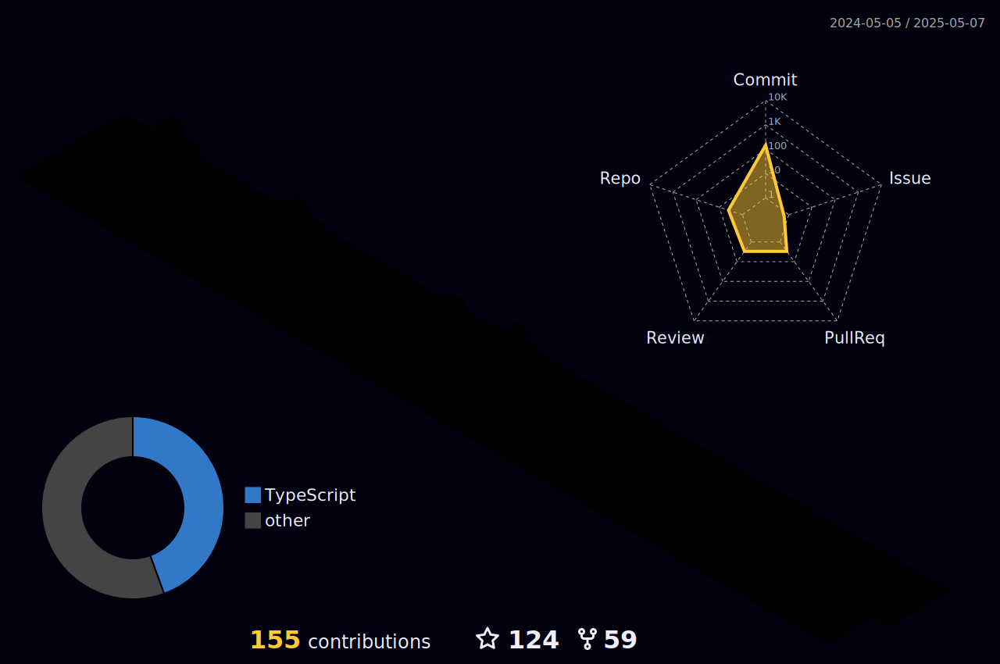

# 👋 Olá, pessoal!  

Sou **Rodrigo Grisi**, desenvolvedor front-end com paixão por criar interfaces modernas e funcionais 💻.  

Atualmente, estou ampliando meus horizontes para o back-end com **NestJS**, **Node.js**, **C#**, e **.NET**, buscando me tornar um profissional full-stack e entregar soluções completas e robustas. 🚀  

Sempre em busca de aprendizado contínuo e desafios que estimulem meu crescimento! 🌟  

---

  
  
  
## 📊 Minhas estatísticas no GitHub  
 |  |  |  
 | ----------- | ----------- |

 
  

   
  

##
   

     
  

  

